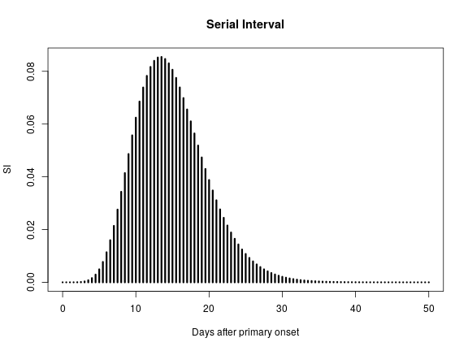
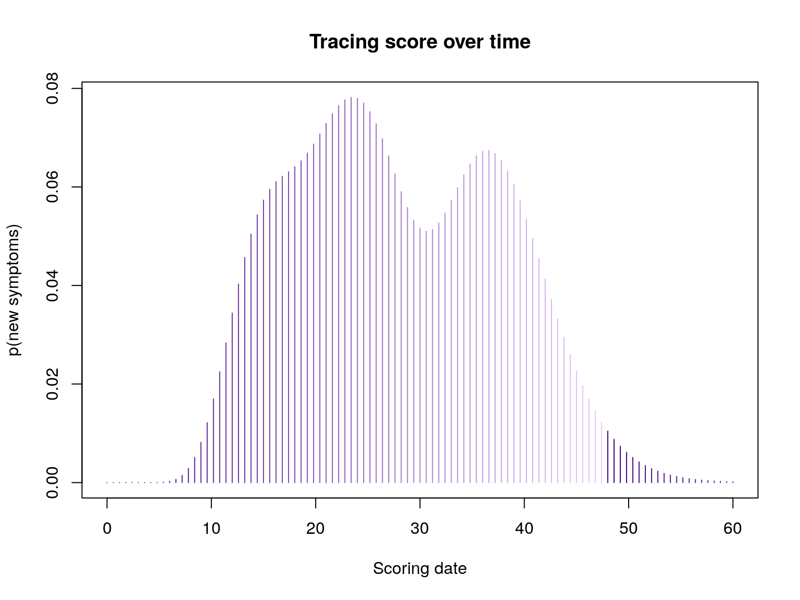
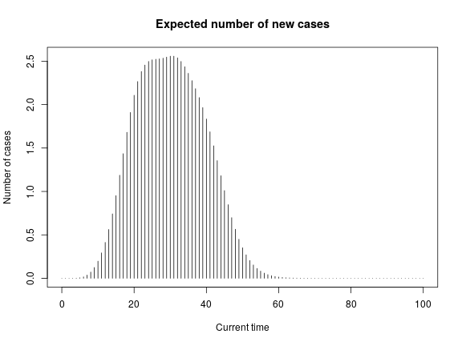
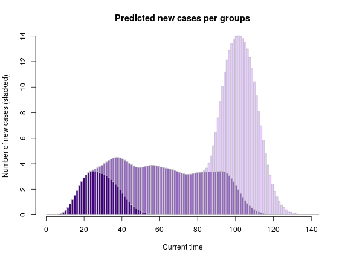

[](https://travis-ci.org/reconhub/tracer)

[](https://codecov.io/github/reconhub/tracer?branch=master)

[](https://cran.r-project.org/package=tracer)


<br>

# Installing the package


To benefit from the latest features and bug fixes, install the development, *github* version of the package using:

```r
devtools::install_github("reconhub/tracer")
```

Note that this requires the package *devtools* installed.

<br>

# What does it do?

The main features of the package include:

- **`contact_score`**: generate a scoring function which computes the tracing score for an individual exposed to cases (a 'contact'), for specified dates.

- **`group_score`**: generate a scoring function which computes the tracing score for a set of individuals exposed to cases ('contacts'), for specified dates.


<br>


<br>

# Resources

<br>

## Vignettes

An overview of *tracer* is provided below in the worked example below.
More detailed tutorials will be distributed as vignettes with the package; to list them, type:

```r
vignette(package = "tracer")
#> no vignettes found
```


<br>
<br>

## Websites

The following websites are available:

- The official *tracer* website, providing an overview of the package's functionalities, up-to-date tutorials and documentation: <br>
[http://www.repidemicsconsortium.org/tracer/](http://www.repidemicsconsortium.org/tracer/)

- The *tracer* project on *github*, useful for developers, contributors, and users wanting to post issues, bug reports and feature requests: <br>
[http://github.com/reconhub/tracer](http://github.com/reconhub/tracer)

- The *tracer* page on CRAN: <br>
[https://CRAN.R-project.org/package=tracer](https://CRAN.R-project.org/package=tracer)


<br>
<br>

## Getting help online

Bug reports and feature requests should be posted on *github* using the [*issue*](http://github.com/reconhub/tracer/issues) system. All other questions should be posted on the **RECON forum**: <br>
[http://www.repidemicsconsortium.org/forum/](http://www.repidemicsconsortium.org/forum/)


<br>
<br>

# A quick overview

The following worked example provides a brief overview of the package's
functionalities. 


## Input parameters

*tracer* needs the following input parameters:

- **`R`**: the average effective reproduction number, i.e. the number of secondary infections per case

- **`lambda`**: the average number of contacts (infectious or not) reported by cases

- **`w`**: the serial interval distribution, i.e. the (discrete) distribution of the time between primary and secondary symptoms.

In practice, `w` will often need to be discretized from a continuous (typically gamma) distribution, of parameters assumed known. We illustrate this procedure using the [*distcrete*](http://github.com/reconhub/distcrete) package:


```r
lambda <- 2.5
R <- 1.8

library(distcrete)
SI.info <- distcrete("gamma", 1L, w = 0, 10, 0.65)
SI.info
#> A discrete distribution
#>   name: gamma
#>   parameters:
#>     shape: 10
#>     rate: 0.65
SI <- SI.info$d
plot(SI, xlim = c(0, 50), type = "h", lwd = 3, main = "Serial Interval",
     xlab = "Days after primary onset")
```




## Tracing score for individual contact

The function `contact_score` will generate a scoring function, which only depends on the date at which the scoring is computed (`t`), and the date of the last visit to this contact:


```r
library(tracer)
args(contact_score)
#> function (x, R, lambda, w) 
#> NULL
```
For instance, using the parameters defined above, and 3 exposures to cases with onset on days 3, 12, and 34:

```r
f <- contact_score(c(3, 12, 24), R, lambda, SI)
f
#> function (t, visit_days_ago = 1L) 
#> {
#>     if (visit_days_ago < 1L) {
#>         stop("'visit_days_ago' cannot be less than 1.")
#>     }
#>     days_ago_to_consider <- seq(0, visit_days_ago - 1L, by = 1L)
#>     days_list <- lapply(days_ago_to_consider, function(i) t - 
#>         i)
#>     out <- double(length(t))
#>     for (days in days_list) {
#>         rates <- Rc * vapply(days, function(day) sum(w(day - 
#>             x)), double(1))
#>         out <- out + 1 - exp(-rates)
#>     }
#>     out
#> }
#> <environment: 0x55e3083b9cb0>

## score on day 10:
f(10)
#> [1] 0.01528583

## score on days 24, 25, 26
f(24:26)
#> [1] 0.07796896 0.07592696 0.07186847

## plotting scores over time
plot(f, xlim = c(0, 60), type = "h", col = pal(80), 
     main = "Tracing score over time", 
     xlab = "Scoring date", ylab = "p(new symptoms)")
#> Error in plot.xy(xy, type, ...): could not find function "pal"
```




## Tracing score for group of contacts

The score of a group of individuals is defined as the expected number of new cases on a given day. The function `group_score` achieves this computation. It generalises `contact_score` to a set of contacts, stored as a list. Each component of the list is a vector of dates of onset of the source cases. `group_score` returns a scoring function which only depends on the date at which the scoring is computed (`t`), and the dates of the last visit of the contacts.:


```r
args(group_score)
#> function (x, R, lambda, w) 
#> NULL
```


We simulate random exposures data for 30 individuals:

```r
set.seed(1)
x <- replicate(30, sample(0:30, sample(1:5), replace = TRUE))
head(x)
#> [[1]]
#> [1] 27 29
#> 
#> [[2]]
#> [1] 21 11 23 15
#> 
#> [[3]]
#> [1]  6 20  3  8
#> 
#> [[4]]
#> [1] 14 18
#> 
#> [[5]]
#> [1]  3 22 12
#> 
#> [[6]]
#> [1] 24  0 14 22 21

g <- group_score(x, R, lambda, SI)
g(c(10,20,30)) # Exp nb of new cases at t=10,20,30
#> [1] 0.1973302 2.1070930 2.5574013


plot(g, xlim = c(0, 100), type = "h", , col = pal(80), 
     main = "Expected number of new cases", 
     xlab = "Current time", ylab = "Number of cases")
#> Error in plot.xy(xy, type, ...): could not find function "pal"
```



We can extend this to several groups with different sizes and incidence dynamics:

```r
set.seed(1)
x1 <- replicate(30, sample(0:20, sample(1:6), replace = TRUE)) # early wave
x2 <- replicate(140, sample(15:70, sample(1:3), replace = TRUE)) # large middle wave
x3 <- replicate(140, sample(65:80, sample(1:4), replace = TRUE)) # late wave
list_g <- lapply(list(x1, x2, x3), group_score, R, lambda, SI)

pred_nb_cases <- sapply(list_g, function(g) g(1:120))

barplot(t(pred_nb_cases), col = pal1(3), border = "grey", 
        main = "Predicted new cases per groups", xlab = "Current time", 
        ylab = "Number of new cases (stacked)")
axis(side=1)
```




# Contributors (by alphabetic order):
- [Thibaut Jombart](https://github.com/thibautjombart)
- [Dirk Schumacher](https://github.com/dirkschumacher)

Please note that this project is released with a [Contributor Code of Conduct](CONDUCT.md). By participating in this project you agree to abide by its terms.

**Maintainer:** Thibaut Jombart (thibautjombart@gmail.com)
